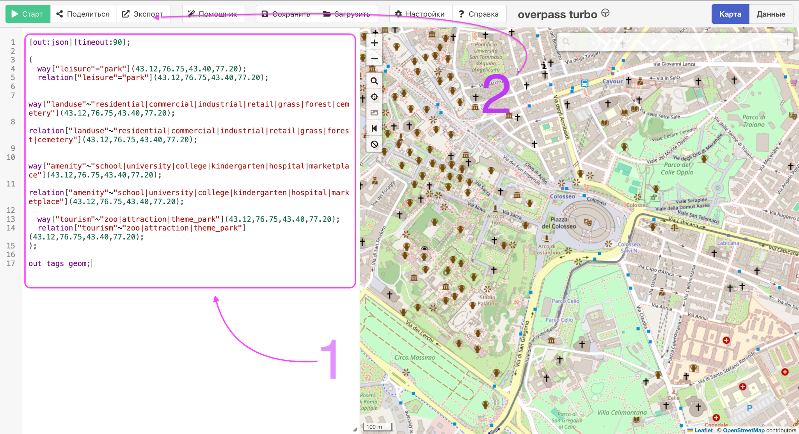
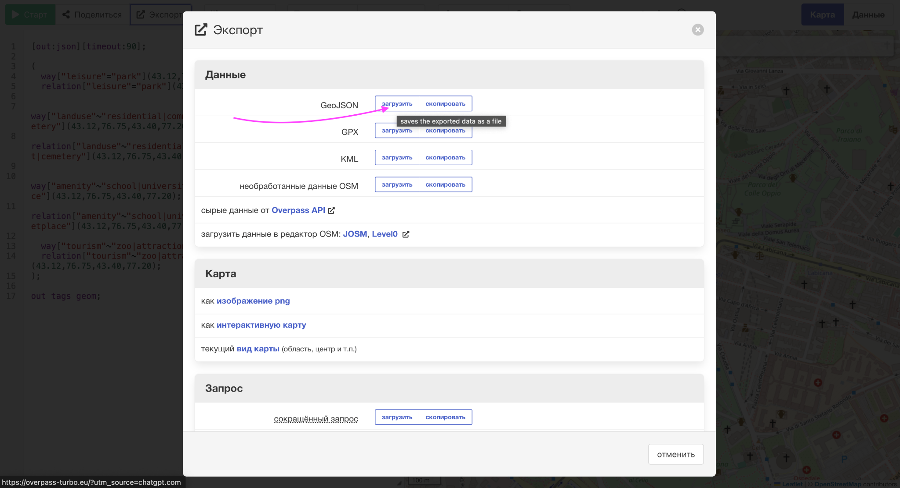

# Casual Example: Rails + ActiveRecord + real OSM polygons

This example shows a simple practical integration of `tg_geometry` in a Rails app.

Goal:

- store real polygon zones in a `zones` table;
- import them from OpenStreetMap / Overpass Turbo as GeoJSON;
- build a `TG::Geometry::Index` through a small registry;
- check which zone covers a given `(lon, lat)` point;
- expose that check through a Rails controller.

This is intentionally casual and application-oriented. It is not a full GIS setup and does not require PostGIS.

---

## 1. Create the `zones` table

For the first practical integration, store polygon geometry as raw GeoJSON text.

Generate a migration and use this schema:

```ruby
class CreateZones < ActiveRecord::Migration[8.1]
  def change
    create_table :zones do |t|
      t.string  :code, null: false
      t.string  :name

      # Data source: "osm", "manual", "city_open_data", etc.
      t.string  :source, null: false, default: "manual"

      # For OSM imports: "way/123", "relation/456", etc.
      t.string  :source_uid

      # park, school, hospital, residential, commercial, etc.
      t.string  :kind, null: false, default: "unknown"

      # Raw GeoJSON geometry only: Polygon / MultiPolygon.
      # Not Feature, not FeatureCollection.
      t.text    :geojson, null: false

      # Original imported feature properties/tags.
      t.jsonb   :properties, null: false, default: {}

      t.boolean :active, null: false, default: true
      t.integer :priority, null: false, default: 100

      t.datetime :imported_at

      t.timestamps
    end

    add_index :zones, :code, unique: true
    add_index :zones, [:source, :source_uid], unique: true, where: "source_uid IS NOT NULL"
    add_index :zones, [:active, :priority, :id]
    add_index :zones, :kind
  end
end
```

Run:

```bash
bin/rails db:migrate
```

Why `text`, not `jsonb`, for `geojson`?

`TG::Geometry::Index.build(..., via: :geojson)` expects a GeoJSON string. Keeping the geometry as text avoids converting `jsonb` back to JSON on every index reload.

---

## 2. Add the `Zone` model

The model validates GeoJSON through `TG::Geometry.parse_geojson` and provides a small importer for a GeoJSON FeatureCollection.

```ruby
# app/models/zone.rb
class Zone < ApplicationRecord
  OSM_KIND_KEYS = %w[
    amenity
    leisure
    landuse
    tourism
    boundary
    natural
    building
    shop
  ].freeze

  KIND_PRIORITY = {
    "hospital" => 10,
    "school" => 20,
    "university" => 20,
    "college" => 20,
    "kindergarten" => 20,
    "park" => 30,
    "marketplace" => 35,
    "commercial" => 40,
    "retail" => 40,
    "industrial" => 45,
    "residential" => 50,
    "forest" => 60,
    "grass" => 70,
    "unknown" => 100
  }.freeze

  validates :code, presence: true, uniqueness: true
  validates :source, presence: true
  validates :kind, presence: true
  validates :geojson, presence: true
  validates :source_uid, uniqueness: { scope: :source }, allow_nil: true
  validates :priority, numericality: { only_integer: true }

  validate :geojson_must_be_parseable_polygon

  class << self
    def import_geojson_file!(path, source: "osm", replace: false)
      data = JSON.parse(File.read(path))

      unless data["type"] == "FeatureCollection"
        raise ArgumentError, "expected GeoJSON FeatureCollection"
      end

      imported = 0
      skipped = 0

      transaction do
        where(source: source).delete_all if replace

        data.fetch("features").each_with_index do |feature, index|
          geometry = feature["geometry"]
          properties = feature["properties"] || {}

          unless geometry && %w[Polygon MultiPolygon].include?(geometry["type"])
            skipped += 1
            next
          end

          source_uid = osm_source_uid(feature, properties, index)
          kind = kind_from_properties(properties)
          geojson = geometry.to_json

          # Fail fast using the same parser that the index uses later.
          TG::Geometry.parse_geojson(geojson)

          zone = find_or_initialize_by(source: source, source_uid: source_uid)

          zone.assign_attributes(
            code: code_for(source, source_uid),
            name: name_from_properties(properties, kind, source_uid),
            kind: kind,
            geojson: geojson,
            properties: properties,
            active: true,
            priority: priority_for(kind),
            imported_at: Time.current
          )

          zone.save!
          imported += 1
        rescue TG::Geometry::ParseError, ActiveRecord::RecordInvalid, JSON::ParserError => e
          skipped += 1
          warn "skip feature #{index}: #{e.class}: #{e.message}"
        end
      end

      { imported: imported, skipped: skipped }
    end

    def kind_from_properties(properties)
      OSM_KIND_KEYS.each do |key|
        value = properties[key]
        return value.to_s if value.present?
      end

      "unknown"
    end

    def priority_for(kind)
      KIND_PRIORITY.fetch(kind.to_s, 100)
    end

    private

    def osm_source_uid(feature, properties, index)
      uid =
        properties["@id"] ||
        feature["id"] ||
        properties["id"]

      uid.present? ? uid.to_s : "feature/#{index}"
    end

    def code_for(source, source_uid)
      "#{source}_#{source_uid}".parameterize(separator: "_")
    end

    def name_from_properties(properties, kind, source_uid)
      properties["name:ru"].presence ||
        properties["name"].presence ||
        properties["name:en"].presence ||
        "#{kind} #{source_uid}"
    end
  end

  private

  def geojson_must_be_parseable_polygon
    geom = TG::Geometry.parse_geojson(geojson)

    unless %i[polygon multipolygon].include?(geom.type)
      errors.add(:geojson, "must be Polygon or MultiPolygon")
    end
  rescue TG::Geometry::ParseError => e
    errors.add(:geojson, "is invalid: #{e.message}")
  end
end
```

---

## 3. Add a rake task for import

```ruby
# lib/tasks/zones.rake
namespace :zones do
  desc "Import zones from GeoJSON FeatureCollection"
  task import_geojson: :environment do
    path = ENV.fetch("PATH", Rails.root.join("db/geo/almaty_zones.geojson").to_s)
    replace = ActiveModel::Type::Boolean.new.cast(ENV.fetch("REPLACE", "false"))

    result = Zone.import_geojson_file!(
      path,
      source: ENV.fetch("SOURCE", "osm"),
      replace: replace
    )

    puts "Imported: #{result[:imported]}, skipped: #{result[:skipped]}"
  end
end
```

---

## 4. Download real polygons from Overpass Turbo

For a practical first dataset, use real OpenStreetMap polygons from [Overpass Turbo](https://overpass-turbo.eu/).

### 4.1. Paste the query

Open Overpass Turbo and paste this query:

```overpass
[out:json][timeout:90];

(
  way["leisure"="park"](43.12,76.75,43.40,77.20);
  relation["leisure"="park"](43.12,76.75,43.40,77.20);

  way["landuse"~"residential|commercial|industrial|retail|grass|forest|cemetery"](43.12,76.75,43.40,77.20);
  relation["landuse"~"residential|commercial|industrial|retail|grass|forest|cemetery"](43.12,76.75,43.40,77.20);

  way["amenity"~"school|university|college|kindergarten|hospital|marketplace"](43.12,76.75,43.40,77.20);
  relation["amenity"~"school|university|college|kindergarten|hospital|marketplace"](43.12,76.75,43.40,77.20);

  way["tourism"~"zoo|attraction|theme_park"](43.12,76.75,43.40,77.20);
  relation["tourism"~"zoo|attraction|theme_park"](43.12,76.75,43.40,77.20);
);

out tags geom;
```

Then click **Run**.



### 4.2. Export as GeoJSON

After the query finishes, click:

1. **Export**
2. **GeoJSON**
3. **download**

Save the file as:

```text
db/geo/almaty_zones.geojson
```



---

## 5. Import zones into the database

Create the directory if needed:

```bash
mkdir -p db/geo
```

Then run:

```bash
bundle exec rake zones:import_geojson PATH=db/geo/almaty_zones.geojson REPLACE=true
```

Example result:

```text
Imported: 7469, skipped: 1
```

---

## 6. Create `ZonesRegistry`

For real overlapping data, ordering matters. `find_covering` returns the first matching id in index insertion order, so we build entries ordered by `priority ASC, id ASC`.

```ruby
# app/services/zones_registry.rb
class ZonesRegistry < TG::Geometry::Registry
  source do
    Zone
      .where(active: true)
      .order(:priority, :id)
      .pluck(:id, :geojson)
  end

  index_options(
    via: :geojson,
    strategy: :rtree,
    predicate: :covers,
    geometry_index: :ystripes
  )
end
```

Notes:

- `via: :geojson` means the index parses GeoJSON strings.
- `strategy: :rtree` is a good practical default for thousands of zones.
- `predicate: :covers` is usually the right default for geofencing because boundary points count as covered.
- Coordinates are passed as `(lon, lat)`, not `(lat, lon)`.

---

## 7. Check everything in `rails console`

Open console:

```bash
bin/rails console
```

### 7.1. Basic data checks

```ruby
Zone.count
Zone.group(:kind).count
```

### 7.2. Parse one geometry

```ruby
zone = Zone.first
geom = TG::Geometry.parse_geojson(zone.geojson)

geom.type
geom.bbox
geom.frozen?
```

Expected:

- `geom.type` returns `:polygon` or `:multipolygon`;
- `geom.bbox` returns `TG::Geometry::Rect`;
- `geom.frozen?` returns `true`.

### 7.3. Build the index

```ruby
registry = ZonesRegistry.new
index = registry.reload!

[index.size, index.strategy, index.predicate, index.frozen?]
```

Example:

```ruby
[7469, :rtree, :covers, true]
```

### 7.4. Check a single point

Important: pass coordinates as `(lon, lat)`.

```ruby
lon = 76.945
lat = 43.238

id = registry.find_covering(lon, lat)
ids = registry.covering_ids(lon, lat)

[id, ids]
```

Inspect matched zones:

```ruby
Zone
  .where(id: ids)
  .order(:priority, :id)
  .pluck(:id, :kind, :name, :priority)
```

### 7.5. Check a rectangle

```ruby
ids = registry.intersecting_rect(76.90, 43.20, 77.00, 43.30)

ids.size
ids.first(20)
```

If you want to inspect a small sample without a giant SQL `IN (...)` query:

```ruby
sample_ids = ids.first(20)
zones_by_id = Zone.where(id: sample_ids).index_by(&:id)

sample_ids.map do |id|
  zone = zones_by_id[id]
  [zone.id, zone.kind, zone.name, zone.priority]
end
```

### 7.6. Check the packed batch API

The packed API expects a flat binary buffer of native-endian doubles:

```text
lon1, lat1, lon2, lat2, ...
```

Do not call `points.pack("d*")` on nested arrays. Flatten first:

```ruby
points = [
  [76.945, 43.238],
  [76.900, 43.250],
  [80.000, 50.000]
]

packed = points.flatten.pack("d*")

registry.covering_ids_batch_packed(packed)
```

You can compare scalar vs batch:

```ruby
scalar = points.map { |lon, lat| registry.find_covering(lon, lat) }
batch  = registry.covering_ids_batch_packed(points.flatten.pack("d*"))

[scalar, batch, scalar == batch]
```

Expected final element:

```ruby
true
```

---

## 8. Add a simple lookup service

```ruby
# app/services/zone_lookup.rb
class ZoneLookup
  class << self
    def registry
      @registry ||= ZonesRegistry.new.tap(&:reload!)
    end

    def reload!
      @registry = ZonesRegistry.new.tap(&:reload!)
    end

    def covering_zones(lon, lat)
      ids = registry.covering_ids(lon, lat)
      zones_by_id = Zone.where(id: ids).index_by(&:id)

      ids.filter_map { |id| zones_by_id[id] }
    end

    def first_zone(lon, lat)
      id = registry.find_covering(lon, lat)
      id && Zone.find_by(id: id)
    end
  end
end
```

---

## 9. Check coordinates in a controller

A minimal controller example:

```ruby
# app/controllers/zones_controller.rb
class ZonesController < ApplicationController
  def check
    lon = Float(params.require(:lon))
    lat = Float(params.require(:lat))

    zones = ZoneLookup.covering_zones(lon, lat)

    render json: {
      lon: lon,
      lat: lat,
      matched: zones.any?,
      first_zone: serialize_zone(zones.first),
      zones: zones.map { |zone| serialize_zone(zone) }
    }
  rescue KeyError, ActionController::ParameterMissing, ArgumentError
    render json: { error: "invalid lon/lat params" }, status: :unprocessable_entity
  end

  private

  def serialize_zone(zone)
    return nil unless zone

    {
      id: zone.id,
      code: zone.code,
      name: zone.name,
      kind: zone.kind,
      priority: zone.priority,
      source: zone.source,
      source_uid: zone.source_uid
    }
  end
end
```

Add a route:

```ruby
# config/routes.rb
Rails.application.routes.draw do
  get "/zones/check", to: "zones#check"
end
```

Now test it:

```bash
curl "http://localhost:3000/zones/check?lon=76.945&lat=43.238"
```

Example response:

```json
{
  "lon": 76.945,
  "lat": 43.238,
  "matched": true,
  "first_zone": {
    "id": 7401,
    "code": "osm_way_...",
    "name": "Айнабулак",
    "kind": "cemetery",
    "priority": 100,
    "source": "osm",
    "source_uid": "way/..."
  },
  "zones": [
    {
      "id": 7401,
      "code": "osm_way_...",
      "name": "Айнабулак",
      "kind": "cemetery",
      "priority": 100,
      "source": "osm",
      "source_uid": "way/..."
    }
  ]
}
```

---

## 10. Summary

This example shows a practical end-to-end setup:

1. store polygon zones in PostgreSQL;
2. import real map polygons from OpenStreetMap / Overpass Turbo;
3. build a `TG::Geometry::Index`;
4. query by `(lon, lat)`;
5. expose the result in a Rails controller.

This simple setup is enough for many point-in-polygon lookup use cases:

- no PostGIS required;
- no external geometry service;
- no Redis;
- no background processing required for the first version.

For production, add your own reload strategy, monitoring, and attribution handling for OSM data.
